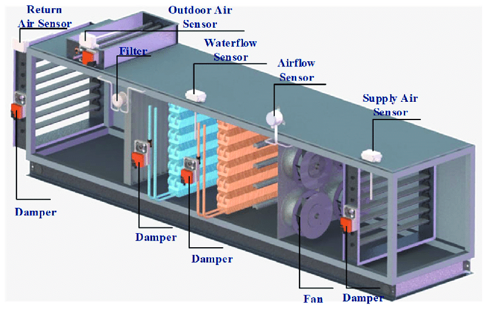

evercool-ifc-2024
=================
- **https://github.com/dirkarnez/web-ifc-three-model-creation**
- update Geometry
  - **https://threejs.org/manual/resources/threejs-primitives.js**
    - **https://threejs.org/manual/#en/primitives**
- Advanced geometry
  - [**The Curve class in threejs a general overview | Dustin John Pfister at github pages**](https://dustinpfister.github.io/2022/06/17/threejs-curve/)
- https://3dviewer.net/
  - to convert `.step` to `.glb`
- https://thatopen.github.io/engine_web-ifc/demo/
  - ```js
    let data= ifcAPI.SaveModel(model);
    let d = new TextDecoder().decode(data);
    debugger;
    ```
- https://ifc43-docs.standards.buildingsmart.org/IFC/RELEASE/IFC4x3/HTML/ifchvacdomain/content.html
- **https://threejs.org/examples/webgl_interactive_cubes**
- [Create A 3D Model Showcase With React, Three.js, and React Three Fiber - YouTube](https://www.youtube.com/watch?v=QaRIHrRclVk)
- [3d Product Viewer](https://3d-product-viewer-with-threejs.netlify.app/)
- [Jeya-Prakash/3D-Product-Viewer-JavaScript-Plugin: 360 Degree Product Viewer using plain JavaScript : Demo-->](https://github.com/Jeya-Prakash/3D-Product-Viewer-JavaScript-Plugin)
- [360-Degree Product Viewer | Threekit](https://www.threekit.com/solutions/360-degree-product-viewer)
- [Create a 3D Product Feature with React, Three.js, & Theatre.js - YouTube](https://www.youtube.com/watch?v=680171tryig)
- [Create a 3D product landing page with ThreeJs and React - Data Orchestration for Composable Commerce](https://www.takeshape.io/articles/create-a-3d-product-landing-page-with-threejs-and-react/)
- [3D Product Visualization on Magento using ThreeJS](https://www.brihaspatitech.com/blog/3d-product-modelling-magento-using-threejs/)
- [Building a 3D Product Configurator with Nuxt and Three.js (Part 2) | by IOsorin | Medium](https://iosorin.medium.com/building-a-3d-product-configurator-using-nuxt-and-three-js-part-2-fc960e19aa18)
- [360 view using CSS3DRenderer - Questions - three.js forum](https://discourse.threejs.org/t/360-view-using-css3drenderer/17045)
- [Add an Interactive 3D Model to Your Website // Three.js Tutorial for Beginners - YouTube](https://www.youtube.com/watch?v=aOQuuotM-Ww)
- !!!!!!!!!!!!!!!!!!!!!!
- [three.js vr - panorama with depth](https://threejs.org/examples/webxr_vr_panorama_depth.html)
- [three.js vr - roller coaster](https://threejs.org/examples/webxr_vr_rollercoaster.html)
- [three.js vr - sandbox](https://threejs.org/examples/webxr_vr_sandbox.html)
- [three.js webgl - arcball controls](https://threejs.org/examples/misc_controls_arcball.html)
- [three.js webgl - map controls](https://threejs.org/examples/misc_controls_map.html)
- [three.js - WebGPU - Particles](https://threejs.org/examples/webgpu_particles.html)
- [three.js webgpu - shadow map](https://threejs.org/examples/webgpu_shadowmap.html)
### Images

### Notes
- use IFCX4 with **IFCPOLYGONALFACESET**
  - ```
    IFCINDEXEDPOLYGONALFACE
    IFCCARTESIANPOINTLIST3D
    IFCPOLYGONALFACESET
    IFCGEOMETRICREPRESENTATIONSUBCONTEXT
    IFCSHAPEREPRESENTATION
    IFCAXIS2PLACEMENT3D
    IFCREPRESENTATIONMAP()
    IFCMAPPEDITEM
    IFCPRODUCTDEFINITIONSHAPE
    IFCLOCALPLACEMENT
    IfcProductRepresentation? should us, i don't know,looks helpful
    ```
### Obj
- **https://blog.csdn.net/xiongzai2016/article/details/108052800**
### References
- https://github.com/dirkarnez/ifcopenshell-pyodide
  - the version is too old... Does not support adding mesh
- https://blenderbim.org/docs-python/ifcopenshell-python/geometry_creation.html
- https://blenderbim.org/docs-python/ifcopenshell-python/geometry_processing.html
- https://blenderbim.org/docs-python/ifcopenshell-python/code_examples.html
- https://blenderbim.org/docs-python/ifcopenshell-python/geometry_creation.html#mesh-representations
- https://community.osarch.org/discussion/1092/ifcopenshell-python-how-to-convert-many-obj-files-to-an-ifc-file
- https://community.osarch.org/discussion/1074/ifcopenshell-python-from-obj-file-to-ifc-file
- https://github.com/Martin15135215/git_ifc_test/blob/main/obj2ifc_meshlab_ifc4.py
- https://github.com/Martin15135215/git_ifc_test/blob/main/obj2ifc4.py
- https://github.com/Martin15135215/git_ifc_test
- https://github.com/Martin15135215/git_ifc_test/blob/main/testface.obj
- https://blenderbim.org/docs-python/ifcopenshell-python/hello_world.html

### Extra
- [Python HVAC – Python applied to HVAC](https://pythoncvc.net/?lang=en)
- https://standards.buildingsmart.org/IFC/RELEASE/IFC4_3/HTML/ifchvacdomain/content.html
- https://jpatacas.github.io/ifcjs-viewer/index.html
- http://www.bimant.com/docs/ifcjs/IfcLoader.getPropertySets/
- https://github.com/ThatOpen/engine_web-ifc/blob/main/src/ts/helpers/properties.ts
- https://anweshgangula.github.io/Basic-Forge/
- https://aps.autodesk.com/blog/publicly-share-models-customized-viewer

### Example
- https://github.com/buildingsmart-community/ifcJSON/blob/6d9b961e343e329f29c007b92f58af2fa8d0bc40/Samples/IFC_4.0/BuildingSMARTSpec/air-terminal-library-object_roundtrip.ifc#L35
- https://github.com/GeometryGym/GeometryGymIFC/blob/b93a6cf2a7f1fe5b6b4d231b247cd185df7cf85b/Core/IFC/Property%20Sets.cs#L139
- https://github.com/AlanRynne/ifc-developer-tools/blob/f45efabe5890042435675c009fc66863ae8b8619/examples/ifc/ifcKit/building-service-element/air-terminal-element.ifc#L53
- https://github.com/EnEff-BIM/EnEffBIM_UseCases/blob/6bf3b0c347c9327ec4e3d6bb9d228f79ad116399/BIM/4.2%20AHUcooling_VDI6020/IFC/4.2%20AHUcooling.ifc#L2102
- https://github.com/BenzclyZhang/IFC-RDF-Convertor_Validator/blob/91fb09644ac4178011c85789763454a505f99626/bin/IFC_roundtrip/air-terminal-element.ifc.ifc#L42
- https://github.com/mrozmanith/IFC_for_Revit/blob/02ceb77198b8d20fe5901c4ed8e495eec27a9c24/2014Revit.IFC/Source/Revit.IFC.Export/Exporter/ExporterInitializer.cs#L877
- https://github.com/giobel/GeometryGymIFC-Examples/tree/master
- https://standards.buildingsmart.org/IFC/RELEASE/IFC4/ADD1/HTML/schema/ifchvacdomain/lexical/.htm
- https://ifc43-docs.standards.buildingsmart.org/IFC/RELEASE/IFC4x3/HTML/lexical/Pset_CoilTypeCommon.htm
- https://ifc43-docs.standards.buildingsmart.org/IFC/RELEASE/IFC4x3/HTML/ifchvacdomain/content.html

### Softwares
- [AIRSOFT – Air Handling Unit Selection Solution](https://www.airhandlingsoftware.com/)
  - https://www.airhandlingsoftware.com/wp-content/uploads/2021/11/Unit_Single_Floor_Panels-e1637399195300.png
  - https://www.airhandlingsoftware.com/wp-content/uploads/2021/11/Unit_Single_Floor.jpg
- [Part 5 - Placing Air Handling Units in OpenBuildings Designer - YouTube](https://www.youtube.com/watch?v=cpP3koUY3nI)
- [Unilab: AHU sample Selection with Unilab AHU 7.0 Selection Software - YouTube](https://www.youtube.com/watch?v=qs9gAXqYW7o)
- [Air Handling Unit (A.H.U) Desing & Selection - HVAC Training - Very Important - YouTube](https://www.youtube.com/watch?v=-ZtdefdZNg8)
- [Air Handling Unit Working principle | HVAC 08 - YouTube](https://www.youtube.com/watch?v=62AXWAaN1DQ)
- OpenBuildings Designer
- [Unilab Smart-Air | UNILAB - Heat Transfer Software](https://www.unilab.eu/heat-transfer-software/unilab-smart-air/)
